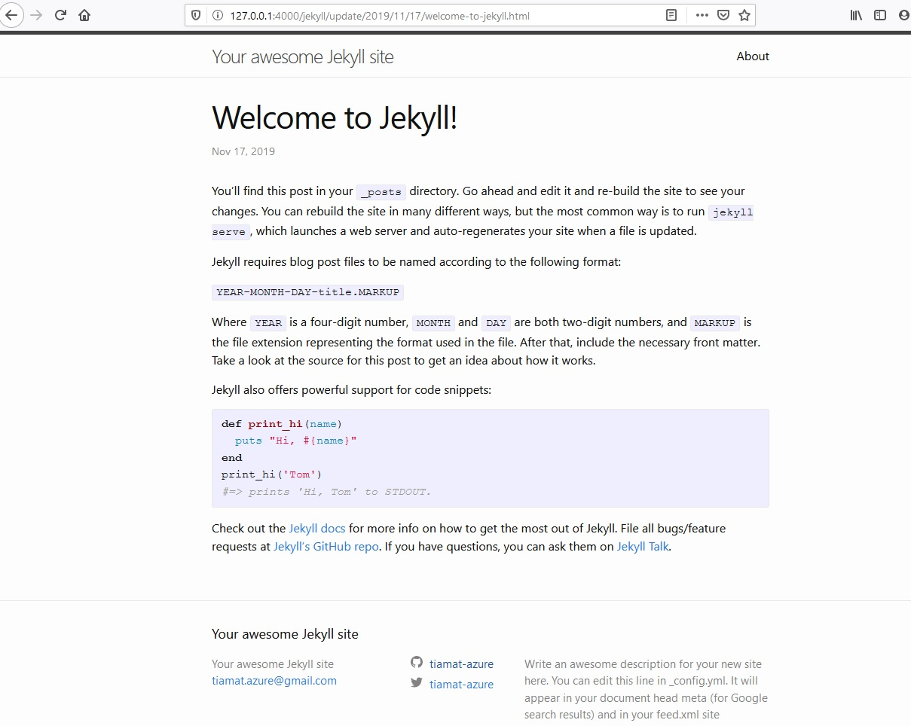

# Jekyll Getting Started
First steps tutorial with Jekyll.

> Windows platform used for this tutorial.

## Documentation

- [Jekyll site](https://jekyllrb.com)
- [Install Linux Windows Subsystem](https://docs.microsoft.com/fr-fr/windows/wsl/install-win10)
- [setting-up-docker-for-windows-and-wsl-to-work-flawlessly](https://nickjanetakis.com/blog/setting-up-docker-for-windows-and-wsl-to-work-flawlessly)
- [Ruby Gem Repository](https://rubygems.org)
- [Minimal Mistake custom theme](https://mmistakes.github.io/minimal-mistakes/docs/navigation/)

## Install Ruby developement environment

> [Linux Windows Subsystem](https://docs.microsoft.com/fr-fr/windows/wsl/install-win10) method is used as [Chocolatey](https://chocolatey.org) install and manual install from [rubyinstaller.org](https://rubyinstaller.org/downloads/) failed on my platform

From Windows `PowerShell` command prompt with admin privilege

    Enable-WindowsOptionalFeature -Online -FeatureName Microsoft-Windows-Subsystem-Linux

Then restart Windows

Install one Linux Distribution from Windows Store : Ubuntu 18-04 chosen

Then launch Linux shell

    bash

Install ruby environement

    sudo apt-get update

    sudo apt-get install ruby-full build-essential zlib1g-dev

Edit ~/.bashrc file

    echo '# Install Ruby Gems to ~/gems' >> ~/.bashrc
    echo 'export GEM_HOME="$HOME/gems"' >> ~/.bashrc
    echo 'export PATH="$HOME/gems/bin:$PATH"' >> ~/.bashrc
    source ~/.bashrc

Verify `ruby` installation

    ruby -v
    
    ruby 2.5.1p57 (2018-03-29 revision 63029) [x86_64-linux-gnu]

Verify `gem` installation

    gem -v
    
    2.7.6

## Install Jekyll

Install `jekyll` and `bundler` gems

    gem install jekyll bundler

Check installation

    jekyll -v && bundler -v
        
    jekyll 4.0.0
    Bundler version 2.0.2

## Create Jekyll site

Create first `jekyll` site

    jekyll new myblog

Change into your new directory
    
    cd myblog

Build the site and make it available on a local server

    bundle exec jekyll serve

Now browse to http://localhost:4000

Stop jekyll, edit `_config.yml` file, change some values then reload jekyll :

    bundle exec jekyll serve

## Test Quarkus.io's Jekyll generated site

Run the following commands to clone and launch Quarkus site locally :

    git clone https://github.com/quarkusio/quarkusio.github.io.git \
      && cd quarkusio.github.io \
      && bundle install \
      && bundle exec jekyll serve

Open http://localhost:4000/

## Customize Jekyll Theme

Usefull commands

    # find versions of jekyll installed localy
    gem list jekyll

    # show current version
    jekyll -v

    # launch spécific version
    jekyll _3.8.6_ -v

    jekyll _4.0.0_ -v

    # Uninstall gem
    gem uninstall jekyll

    # Install specific version
    gem install jekyll -v 3.5
